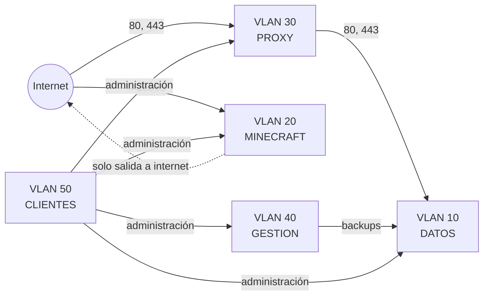

```mermaid
flowchart LR
    NET(("Internet"))
    CLI["VLAN 50<br/>CLIENTES"]
    PRX["VLAN 30<br/>PROXY"]
    MC["VLAN 20<br/>MINECRAFT"]
    DAT["VLAN 10<br/>DATOS"]
    GES["VLAN 40<br/>GESTION"]
 
    NET -- "80, 443" --> PRX
    NET -- "25565" --> MC
    PRX -- "80, 443" --> DAT
    GES -- "backups" --> DAT
    CLI -- "administración" --> DAT & GES & PRX & MC
    MC -. "solo salida a internet" .-> NET
```
